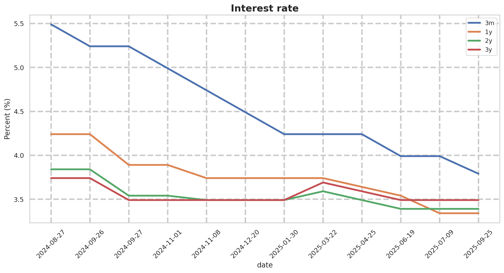

[](https://github.com/andreyhgl/webscrap-interest-rate/actions/workflows/render_lineplot.yml)

# README

Visualise the morgage interest rate over time



### The project

This repository (1) extract the current mortgage interest rate (from swedbank), (2) saves if the rate is adjusted, and (3) plots the rate over time.

### File structure

```
project/
|-- .github/workflows
|   |-- render_lineplot.yml
|   `-- webscrape.yml
|-- bin/
|   |-- lineplot.py
|   ´-- webscrape.py
|-- env/requirements.txt
|-- image/lineplot.png
|-- swedbank.csv
`-- README.md
```

<details>
  <summary>Setup</summary><br>
  
The `requirements.txt` contains all the libraries used for the project. 

```sh
# To generate requirements.txt

pip3 install pipreqs
python -m pipreqs.pipreqs env/requirements.txt
```

The `bin/webscrape.py` extract the current mortgage interest rate and saves it into `swedbank.csv`.

The `.github/workflows/webscrape.yml` checks the homepage every work day.

> [!TIP]
> Github Actions has a built in function for schedule executable actions; CI/CD (Continous Integration and Continuous Deployment).

```sh
# generate the file

mkdir -p .github/workflows
touch .github/workflows/webscrape.yml
```

Paste the the following into it:

```yml
name: check homepage

on:
  schedule:
    - cron: '0 13 * * 1-5' # mon - fri @ 13:00 PM (stockholm)

jobs:
  build:
    runs-on: ubuntu-latest

    steps:
    - uses: actions/checkout@v4
    - uses: actions/setup-python@v5
      with:
        python-version: '3.12'
    - run: pip install -r requirements.txt
    
    - name: check homepage
      run: |
        python webscrape.py
```

</details>